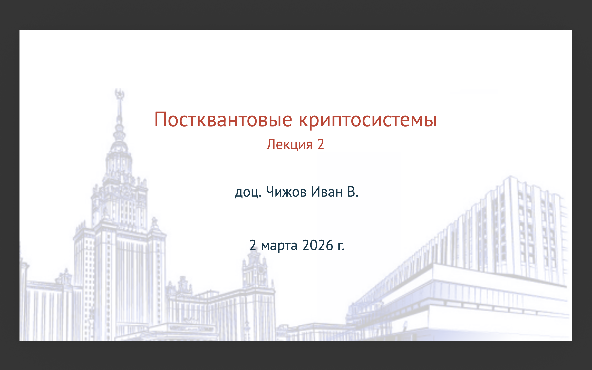
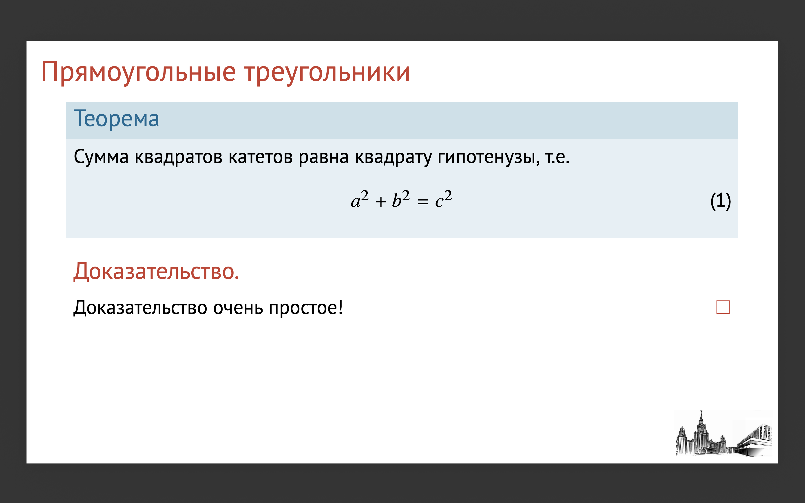
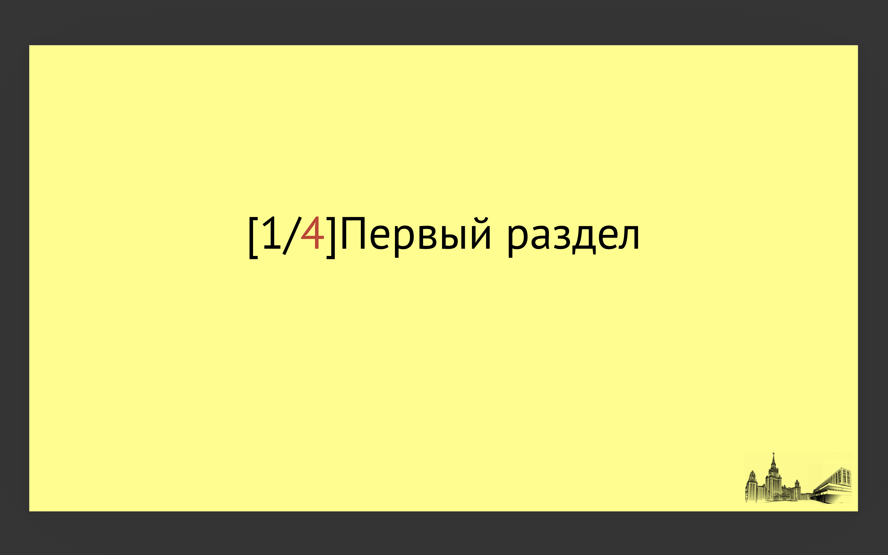

# cmcmsu — Beamer Theme for CMC MSU

**cmcmsu** is a modern **LaTeX Beamer theme** designed for mathematical and theoretical presentations:

- coding theory
- cryptography
- discrete mathematics
- theoretical computer science

The theme focuses on **readability of dense mathematical slides** and a **minimal visual style** suitable for research talks.

---

# Overview

Main features:

- minimalistic theorem environments
- consistent appearance across **XeLaTeX / LuaLaTeX / pdfLaTeX**
- **PT Sans** typography
- lightweight layout optimized for mathematical content
- **self-contained installation** (no TEXMF configuration required)

---

# Screenshots

### Title slide



### Theorem slide



### Section transition



---

# Minimal Example

```latex
\documentclass[aspectratio=169, 12pt]{beamer}
\usetheme{cmcmsu}

\usepackage[utf8]{inputenc}
\usepackage[T1, T2A]{fontenc}
\usepackage[russian]{babel}

\title{Название}
\subtitle{Подназвание}
\author{Автор}
\date{\today}

\begin{document}
\maketitle

\begin{frame}{Линейные коды}

\begin{definition}
Линейным кодом называется подпространство
\[ C \subseteq \mathbb{F}_2^n . \]
Размерность кода обозначается через \( k = \dim \mathcal{C}\).
\end{definition}

\pause

\begin{theorem}

Пусть \(C\)~--- линейный \([n,k]\)-код над \(\mathbb{F}_2\).
Тогда
\[ |C| = 2^k . \]

\end{theorem}

\end{frame}

\end{document}
```

---

# Typography

The theme supports all major LaTeX engines and keeps a consistent visual appearance.

## XeLaTeX / LuaLaTeX

- Text font: **PT Sans**
- Math font: **TeX Gyre Termes Math**
- Unicode-native workflow

## pdfLaTeX

- Text font: **Paratype (PT Sans family)**
- Math font: **newtxmath**
- full **Cyrillic support**

---

# Theorem and Block Design

The theme implements a minimal theorem layout:

- colored **vertical bar**
- **no background fill**
- colored theorem title
- body text follows immediately

Supported theorem environments:

- `definition`
- `proposition`
- `theorem`

Standard Beamer blocks are mapped automatically:

| Beamer block | Style |
|---|---|
| `block` | definition |
| `alertblock` | theorem |
| `exampleblock` | example |

---

# Repository Structure

```
cmcmsu-beamertheme/
│
├── beamerthemecmcmsu.sty
├── cmcmsu.sty
├── example.tex
├── example_xelatex.tex
├── minimal.tex
│
├── screenshots/
│   ├── title.png
│   ├── theorem.png
│   └── section.png
│
└── images/
    ├── cmc-msu.jpg
    ├── msu-cmc-logo.png
    └── msu-cmc-logo2.png
```

The theme automatically detects its own location, so no manual path configuration is required.

---

# Installation

## Local installation (simplest)

Download or clone the repository and place the theme files in your project directory.

Example structure:

```
project/
│
├── beamerthemecmcmsu.sty
├── cmcmsu.sty
├── main.tex
└── images/
```

You can also start from the provided examples:

```
example.tex
example_xelatex.tex
```

---

## Local installation (recommended)

Place the repository directory next to your presentation:

```
project/
├── main.tex
└── cmcmsu-beamertheme/
```

Then load the theme with:

```latex
\usepackage[<options>]{cmcmsu-beamertheme/cmcmsu}
```

---

## Global installation (TEXMF)

### 1. Locate your TEXMFHOME directory

Run in terminal:

```
kpsewhich -var-value TEXMFHOME
```

Typical values:

- macOS: `~/Library/texmf`
- Linux: `~/texmf`

---

### 2. Create directory structure

```
mkdir -p ~/texmf/tex/latex
```

---

### 3. Create symbolic link

```
ln -s /ABS/PATH/TO/cmcmsu-beamertheme \
~/texmf/tex/latex/cmcmsu-beamertheme
```

---

### 4. Update the filename database

```
mktexlsr
```

---

### 5. Verify installation

```
kpsewhich beamerthemecmcmsu.sty
```

Expected output:

```
.../cmcmsu-beamertheme/beamerthemecmcmsu.sty
```

---

# Usage

## Standard Beamer usage

```latex
\documentclass[aspectratio=169,12pt]{beamer}
\usetheme[<options>]{cmcmsu}
```

## Local repository usage

```latex
\documentclass[aspectratio=169,12pt]{beamer}
\usepackage[<options>]{cmcmsu-beamertheme/cmcmsu}
```

---

# Theme Options

Example:

```latex
\usepackage[
  titlebackground=true,
  sectiontransition=true,
  cornerlogo=true
]{cmcmsu}
```

### Available options

| Option | Description |
|---|---|
| `titlebackground` | background logo on title slide |
| `sectiontransition` | section transition frames |
| `cornerlogo` | small corner logo |

---

# Font Options (pdfLaTeX)

Default configuration:

```
paratype + newtxmath
```

Example customization:

```latex
\usepackage[
  font=default,
  mathfont=cm
]{cmcmsu}
```

### Text fonts

| Option | Description |
|---|---|
| `paratype` | PT Sans family (recommended) |
| `default` | Computer Modern |

### Math fonts

| Option | Description |
|---|---|
| `newtx` | Times-like math (default) |
| `cm` | Computer Modern |
| `stix2` | STIX2 |

---

# Compilation Engines

Recommended:

- **XeLaTeX**
- **LuaLaTeX**

`pdfLaTeX` is fully supported.

---

# Language Support

The theme **does not load language packages** intentionally.

Users should configure language settings manually.

Example:

```latex
\usepackage[T2A]{fontenc}
\usepackage[utf8]{inputenc}
\usepackage[russian]{babel}
```

For XeLaTeX/LuaLaTeX use `polyglossia`.

---

# Design Philosophy

The theme is optimized for:

- mathematical presentations
- theorem-heavy slides
- projection readability
- minimal visual noise

Large colored boxes and heavy backgrounds are intentionally avoided.

---

# License

MIT License

---

# Author

**Ivan Chizhov**
CMC MSU — Information Security Department

---

# Acknowledgements

Inspired by modern Beamer themes:

- Metropolis
- Madrid
- minimal theorem layouts
